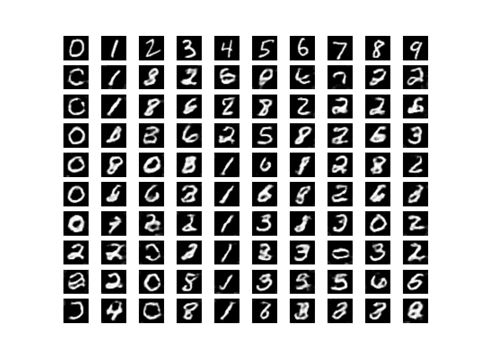

# MNIST

## Guidelines

- large filter size works better (12>5>3)
- filters need to overlap
- but 1\*1 would bring too many parameters, so 2\*2 seems to be a good choice
- learning rate?
- pcd k>5
- sometimes may have dull outputs (all 0, all 1...), but more epochs generally yield better results
- a relatively larger batch size would give better results (20 > 10)


## Interesting facts that we ~~wont' understand ever~~ don't understand yet

- half of the filters visualized are identical and useless
- legit degit would be shaken away after some iterations, so when would it converge (or never)?  Converge means eigenvector?
- ​

## HuNet

> (['conv',(12,12,1,64), (2,2)]
> ['conv',(5,5,64,128),(2,2)],
> ['fc', 500])

#### Evolution plot

row: vis per 100 iterations with raw input at first row

- 50

  

- 55/60

not so good, many 0 and 1

#### Filter Visualizations

at epoch 50

- `w0: (12,12,1,64)` a lot of them seem to be useless?

 

- w1: (5,5,64,64)`  too small... and second layers filter usually don't make lots of sense

 


## Hu-32

#### Evolution Plot

- 45

 

 


#### Filter

- `w0: (12,12,1,32)`  the redundant filters look fucking same as HuNet's?

 

Deeper layers make no sense.

## Hu-128

#### Evolution Plot

- 55

 


- 50/60 

not so good, many 0 and 1


#### FC

forgot the actual configuration, but they should look similar...

- epoch 40 with pcd k=10

 

- epoch 10 with pcd k=100

 


## Some other random results

obtained at epoch 20, using pcd with k=10

- default

```
(['conv',(5,5,1,64), (2,2)], #0
 ['conv',(5,5,64,64),(2,2)],
 ['fc', 512])
```

 

- increase stride

```
(['conv',(5,5,1,64), (3,3)], #1
 ['conv',(5,5,64,64),(3,3)],
 ['fc', 512])
```


- and more 

```
(['conv',(5,5,1,64), (4,4)], #2
 ['conv',(5,5,64,64),(4,4)],
 ['fc', 512])
```


- stride = size

```
(['conv',(5,5,1,64), (5,5)], #3
 ['conv',(5,5,64,64),(5,5)],
 ['fc', 512])
```


- more fc units

```
(['conv',(5,5,1,64), (2,2)], #4
 ['conv',(5,5,64,64),(2,2)],
 ['fc', 1024])
```


- more filters

```
(['conv',(5,5,1,64), (2,2)], #5
 ['conv',(5,5,64,128),(2,2)],
 ['fc', 512])
```


- and more filters

```
(['conv',(5,5,1,128), (2,2)], #6
 ['conv',(5,5,128,128),(2,2)],
 ['fc', 512])
```

all black

- stride  = 1

```
(['conv',(3,3,1,64), (1,1)], #7
 ['conv',(3,3,64,128),(1,1)],
 ['fc', 512])
```

explode, all white output

- smaller filter size

worse than 5*5

```
(['conv',(3,3,1,64), (2,2)], #8
 ['conv',(3,3,64,64),(2,2)],
 ['fc', 512])
```


- stride =  filter size again

```
(['conv',(3,3,1,64), (3,3)], #9
 ['conv',(3,3,64,64),(3,3)],
 ['fc', 512])
```


- deeper

might need more epoch

```
(['conv',(5,5,1,32), (2,2)], #10
 ['conv',(5,5,32,32),(2,2)],
 ['conv',(3,3,32,64),(2,2)],
 ['conv',(3,3,64,128),(2,2)],
 ['fc',512])
```


- upside down for fun

40 epochs

```
(['conv',(3,3,1,32), (2,2)], #11
 ['conv',(3,3,32,32),(2,2)],
 ['conv',(5,5,32,64),(2,2)],
 ['fc',1024])
```


- and more filters

```
(['conv',(5,5,1,64), (2,2)], #12
 ['conv',(5,5,64,128),(2,2)],
 ['conv',(5,5,128,128),(2,2)],
 ['fc',1024])
```

all white

- different filter size

40 epochs

```
(['conv',(4,4,1,64), (3,3)], #13
 ['conv',(4,4,64,128),(3,3)],
 ['conv',(4,4,128,128),(3,3)],
 ['fc',1024])
```


