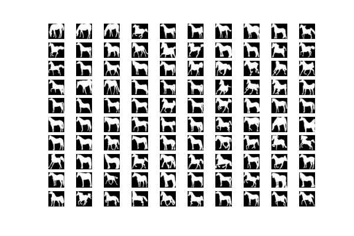
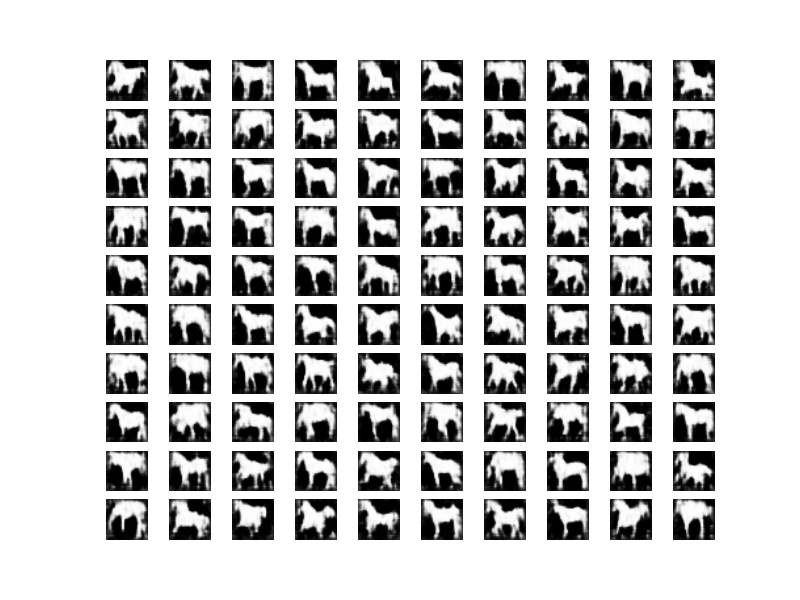
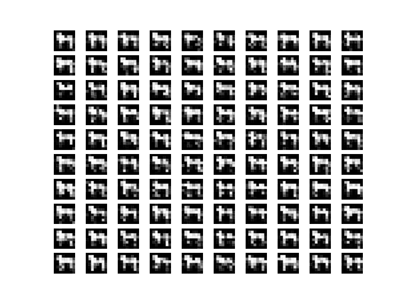

## V2

### Setups

#### dataset

All results obtained on Weizmann Horse's figure_ground images. There are 328 pictures in total, each comes with a different size. Images were cropped so that the horses were centered and then rescaled to 32*32. `horse209.png` has discarded because it has too much noise in the background thus hard to rescale. The last 10 images were left out for validation purpose.

First/Last 100.

  

#### Outputs format

- random: 100 samples generated from uniform(0,1) noises after 1000 iterations of Gibbs Sampling
- random_evo: visible outputs generated from 10 given noises at every 100 iterations
- test: visible outputs generated from 10 given horse images in validation set at every 100 iterations
- Add a cutoff value does not help make images looks better

#### Hyper parameters

AdamOptimizer with learning rate 1e-4 (dacay to 1e-5 at 75% epoch), batch size 20, pcd 5

- A 1e-3 learning rate will lead to explosion. Manually change lr at different stages didn't make a noticable difference, as long as we don't touch the 1e-3 danger zone.
- As Hinton in guideTR pointed out, larger bathc size usully help. A typical value would be the number of different categories with one for each class in one batch. In this particular dataset, we have only one class , i.e. horse, but many of them are of different postures. We've tried 5, 10 and 20 here, and found that 10/20 makes little difference while 5 easily stuck in local optimum.
- A larger pcd value means the persistent state catch up with the model more quickly. But we are worried that after some large epochs, the pcd state would actually have  a reasonable image. Penalty on such pcd state would cancel out good results.

### Observations and caveats

This dataset is indeed ***WAY TOO*** small, thus inevitably we suffer from overfitting to some extent. Currently our largest enemy is that at certain epoch the model would converge to only a small subset of outputs for random noise inputs, when these outputs becomes too strong an attractor. Meanwhile if we feed the model with training data, it is able to somehow preserve the detail, so they are still local optimums. A few more epochs could draw the model back on the right track but this phenomenon is observed repeatedly throughout the training. WHEN TO STOP IS ESSENTIAL (, but how could we measure this anyway? generative models themselves are hard to evaluate analytically).

 

Possible solutions?

1. Decaying lr for more epoch, but in practice we have not observe a major difference.
2. Find a point where we overfit? maybe with energy from validation set?

### Some typical results

- default

> ['conv', (12,12,1,64), (2,2)]
>
> ['conv', (5,5,64,128), (2,2)]
>
> ['fc', 500]

Usually no sharp boundaries.

Random at  epoch 2500 out of 3000. There do are slight difference between those of the same gestures.

std_epoch2500-random](weizmann/std_epoch2500-random.png)

Another example using Gradient Descent. In general, this would result in less overfitting (still exists). There might be lots of legs, but this also means more diversity.

 

- deeper by decompose the second layer/both layers

> ['conv', (12,12,1,64), (2,2)]
>
> ['conv', (3,3,64,64), (1,1)]
>
> ['conv', (3,3,64,128), (1,1)]
>
> ['fc', 500]

> ['conv', (6,6,1,64), (2,2)]
>
> ['conv', (3,3,64,64), (1,1)]
>
> ['conv', (3,3,64,128), (1,1)]
>
> ['conv', (3,3,128,128), (1,1)]
>
> ['fc', 500]

results are usually blurred in details

6333_random at epoch 4700:

 

- smaller filters

> ['conv', (8,8,64,64), (2,2)]
>
> ['conv', (3,3,64,128), (2,2)]
>
> ['fc', 500]

results are usually blurred in details, same as above

We might conclude that smaller filters at first layer failed to capture relations between different parts well.

83_random at epoch 4800:

 

- fewer filters

> ['conv', (12,12,1,32), (2,2)]
>
> ['conv', (5,5,32,64), (2,2)]
>
> ['fc', 500]

It is worth noting that many of the filters in our default model is not of great usage. So we tried reducing the number of filters used. It turned out that such reduction would cause the model to overfit most of the time, giving similar outputs for all inputs. So the capacity is not large enough.

 

## Higher resolution 64*64

***TODO: Haven't tried on recenterred data yet.***

Results either super overfit or detailed not clear. 

Random at Epoch 2000

Validation is not that bad, but not impressive at all.

Validation at Epoch 1800

 

## V1, archived

resized to 28\*28 / 32\*32

- reproduce shapebm

>  pure FC: 500-1000-1000

Both resulted in all outputs being the same: horse without legs  

>  Conv to simulate FC: (16,16,1,500) with stride (14,14)

- pure conv without FC on 32\*32

> (4, 4, 1, ?), (4, 4) # 8\*8
>
> (4, 4, ?, ?), (4, 4) # 2\*2
>
> (2, 2, ?, ?), (2, 2) # 1\*1

pixels from the same receptive fields seem to have unified value

- pure conv (same stride as filter size 